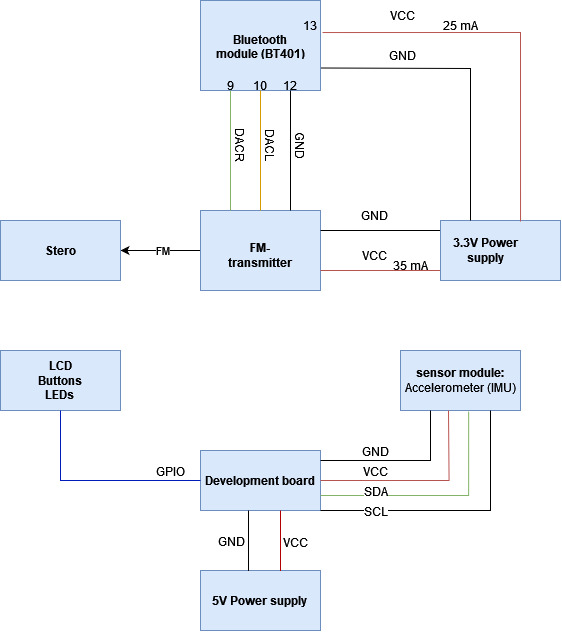

# Cartune
This is a first year electrical engineering project. This project includes an automatic parking disc and a bluetooth device paired with an FM transmitter in order to connect a mobile phone to car stereo. Made to improve the driver expirience for older cars (<2012). The project is split in 2 parts. The seconds part is pure hardware, and the first - automatic parking disc - nedded additional software for the components. This repository is focused on the first part.

## 🛠️Hardware
Complete hardware diagram: <br\>
  
Microcontroller: GD32VF103 RISC-V 32-bit MCU  
Modules:  
- 4 push button switches
- ICM-20600 accelerometer, code can apply for mpu6500 aswell 
- RGB LCD Display 160x80px

#### Buttons
4 buttons on breadboard with pull up resistor(10KΩ) to 3.3v.  
closest to MCU on closest pin (hence BUTTON1 on pin A4 and BUTTON4 on pin A7).  
Button actions are respectively  ↑HOUR-UP : ↓HOUR-DOWN : ↑MINUTE-UP : ↓MINUTE-DOWN  

#### LCD (TEMP)
The LCD screen used is the one that was already available on the IO card due to resource constraints. All its pins are also directly connected to the MCU.  
Pin connections from MCU to LCD:
- PC13 – CS (chip select)
- PC15 – RS (register select)
- PB13 – SCL (serial clock)
- PB15 – SDA (serial data)
- GND - GND
- VCC - 3.3v

#### IMU 
pins from MCU directly to IMU:  
- VCC - 3.3v
- GND - GND
- B7 - SDA (IIC)
- B6 - SCL (IIC)

## </>💻Software
Drivers based on RISC-V ASM  
Flowchart for the main code:  

The simplified green switch case is a simplification of the code that describes how to change the clock based on the button pressed. Button actions are respectively ↑HOUR-UP; ↓HOURS-DOWN; ↑MIN-UP; ↓MIN-DOWN; as mentioned in the hardware section. 
  
NOTE: in practice to run the code the relevant files from "library" have to be in the same directory as the main.c file. The separation is for clarity.

### 📝Documentation
RISC-V ASM: [riscv-card.pdf](https://github.com/RoboKamu/Projekt-grupp7/files/14948728/riscv-card.pdf)  
MCU: [GD32VF103_Datasheet_Rev1.0-1.pdf](https://github.com/RoboKamu/Projekt-grupp7/files/14948731/GD32VF103_Datasheet_Rev1.0-1.pdf)  
User Guide: [GD32VF103_User_Manual_EN_V1.0.pdf](https://github.com/RoboKamu/Projekt-grupp7/files/14948745/GD32VF103_User_Manual_EN_V1.0.pdf)  
Firmware Guide: [GD32VF103_Firmware_Library_User_Guide_V1.0.pdf](https://github.com/RoboKamu/Projekt-grupp7/files/14948750/GD32VF103_Firmware_Library_User_Guide_V1.0.pdf)  
IO circuit: [IO-card_10-11-2020.pdf](https://github.com/RoboKamu/Projekt-grupp7/files/14948757/IO-card_10-11-2020.pdf)  
MCU circuit: [MCU-board.pdf](https://github.com/RoboKamu/Projekt-grupp7/files/14948764/MCU-board.pdf)

## Credits
Examiner: [Examiner github](https://github.com/linusreM)